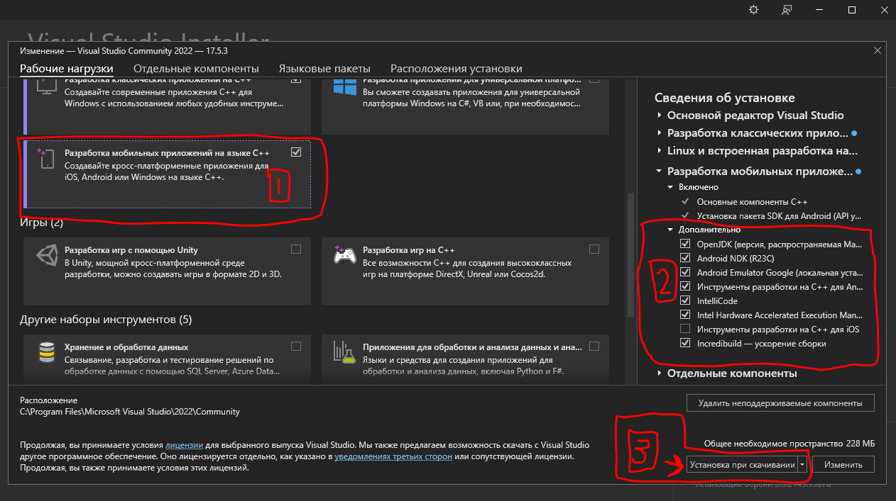

**MiniApp is the basis for creating your first C++ application for Android!.**

miniapp was inspired by the RawdrawAndroid project, but serves as a further development of Android apps.

*NOTE for ADVENTURERS: This is the basic part that allows you to run 'Hello World' on ImGui. Don't be afraid to write in the 'Issue', I will help you in any way I can.*

---

 

Features
--------
  - **NO Java & Kotlin !!!**
  - Special for: **Android**
  - Written in C/C++
  - Hardware accelerated with OpenGL (**ES 3.0**)
  - **Visual Studio 2022**
  - **ImGui v1.89.4**
  - Icons for your app
  - Calling the keyboard from JNI (coming soon)
  - **Free and open source**.
  
## Build  

We need:  
* Visual Studio 2022 or later  
    * Mobile Development with C++
        * Android NDK (I used 25.1.8937393)
        * OpenJDK
        * C++ Android development tools
        * ~~Apache Ant~~ (it was cut out by the developers VS 2022)
        * Android SDK (Use Android Studio for downloading)
* Android Emulaltor: VS emulator is slow. Better use your phone. Or use emulator like Nox (5.x,7.x), leapdroid (4.x).  
* Logcat: For convenient logging of Android (logcat in VS), I advise you to install this: https://marketplace.visualstudio.com/items?itemName=LancelotChen.AndroidLogcatOutput  
  
Open `miniapp.sln` with Visual Studio 2022

Next, you need to change all the paths and configure everything for yourself: VS 2022 (project properties, paths to build-cmd.bat, paths for IntelliSense), Android.mk , Application.mk , buildAPK.bat, AndroidManifest.

**BE CAREFUL WHEN CHANGING PATHS**

Note: When configuring paths for IntelliSense, depending on the NDK version, the paths to 'include' may differ
  
## How do I change the icons?

Make png icon in size 192x192 used Photoshop, Paint and other.  
Load you icon in https://easyappicon.com/ and selected *adaptive icon*  
You get zip archive and in folder Android there will be folders with icons.  
  
## Special thanks  
  
- **graysuit**: he helped me figure out how to connect Android to VS and much more  
  
## Screenshot  

