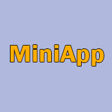
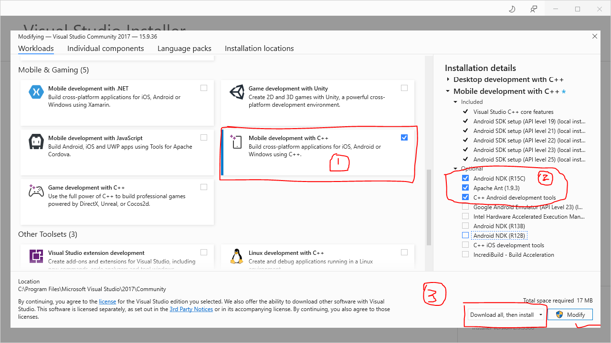

# MiniApp
Stop using Java when creating your Android app! Create an application entirely in C++

Example just app for Android in C++ with ImGUI (how graphic wrapper)

## Features  
- OpenGL v3 is used  
- Added icons  
- ImGUI v1.83  
- Calling the keyboard from JNI  
  
## Build  

We need:  
* Visual Studio 2015 or later  
    * Mobile Development with C++
        * Android NDK 
        * OpenJDK (installed bydefault automatically)
        * C++ Android development tools
        * Apache Ant
        * Android SDK (installed bydefault automatically)
* Android Emulaltor: VS emulator is slow. Better use your phone. Or use emulator like Nox (5.x,7.x), leapdroid (4.x).  
* Logcat: For convenient logging of Android (logcat in VS), I advise you to install this: https://marketplace.visualstudio.com/items?itemName=LancelotChen.AndroidLogcatOutput  
  
Open `miniapp.sln` with Visual Studio and compile
  
## How do I change the icons?

Make png icon in size 192x192 used Photoshop, Paint and other.  
Load you icon in https://easyappicon.com/ and selected *adaptive icon*  
You get zip archive and in folder Android there will be folders with icons.  
  
## Special thanks  
  
- **graysuit**: he helped me figure out how to connect Android to VS and much more  
  
## Screenshot  

